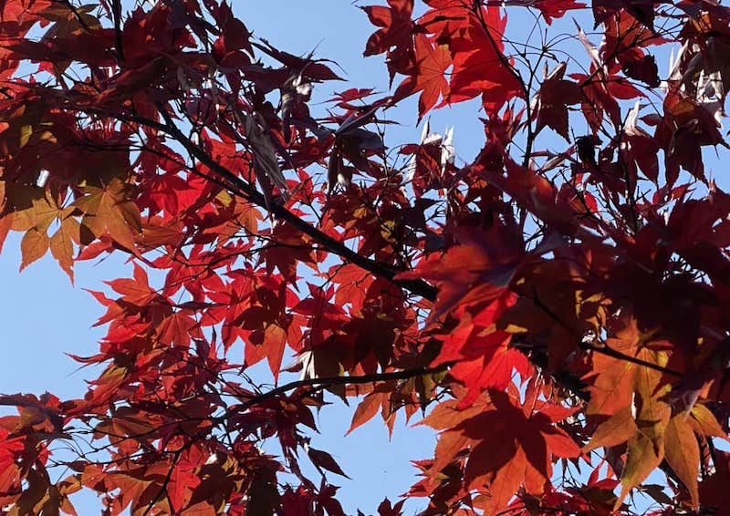
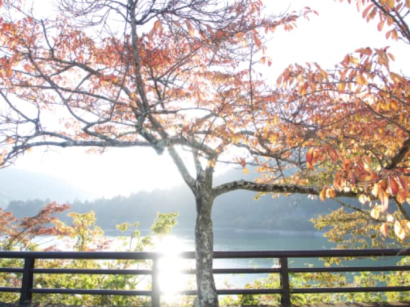

<!DOCTYPE html>
<html lang="jp">
<head>
    <meta charset="UTF-8">
    <meta name="viewport" content="width=device-width, initial-scale=1.0">
    <meta http-equiv="X-UA-Compatible" content="ie=edge">
    <title>Tokyo outdoor</title>
    <link rel="stylesheet" href="./reset.css">
    <link rel="stylesheet" href="./style.css">
    <link href="https://use.fontawesome.com/releases/v5.6.1/css/all.css" rel="stylesheet">

</head>
<body>
    <section class="mv">
        
    </section>

    <section class="mv-message">
        

            
少し立ち止まって、まわりを見渡す。 見えてこなかった景色が、 目の前に広がる。 体験がもたらす、生の実感。

            
わたしは今、ここにいる。 今ここで、未来が変わる。 未来を少し、変えてみよう。

        
<!-- .inner -->
    </section>

    <section class="photo-area">
        
        
        
    </section>

    <section class="blog-area">
        

            
Blog

            

            <article class="blog-post">
                
                
ここに記事のタイトルが入ります。

                
ここに記事の内容が入ります。

                <time class="blog-time">2019年12月18日</time>
            </article>
            <article class="blog-post">
                
                
ここに記事のタイトルが入ります。

                
ここに記事の内容が入ります。

                <time class="blog-time">2019年12月18日</time>
            </article>
            <article class="blog-post">
                
                
ここに記事のタイトルが入ります。

                
ここに記事の内容が入ります。

                <time class="blog-time">2019年12月18日</time>
            </article>
            <article class="blog-post">
                
                
ここに記事のタイトルが入ります。

                
ここに記事の内容が入ります。

                <time class="blog-time">2019年12月18日</time>
            </article>
            

        
<!-- .inner -->
    </section>

    <footer>
        <small>Copyright 2020 Tokyo outdoor</small>
    </footer>

</body>
</html>
